<div align="center">

# 📰LimitlessNews(Kabar)

### A modern Android news application built with Kotlin, Jetpack Compose, Clean Architecture & MVVM

Explore personalized news, search articles, bookmark content locally, manage preferences, and maintain your profile through a modern Android experience.

</div>

---

## 📱 About The Project

**LimitlessNews(Kabar)** is a modern Android news application designed using **Clean Architecture**, **MVVM**, and the **Repository Pattern**.

The application allows users to personalize their news experience by selecting topics, countries, and news sources. Users can browse news using infinite scrolling, search articles, save bookmarks locally, manage preferences, authenticate securely, and maintain their profile.

The project focuses on building a scalable Android architecture with clear separation between the **Presentation**, **Domain**, and **Data** layers.

---

# ✨ Features

## 🔐 Authentication

- User Signup
- User Login
- Forgot Password
- Firebase Authentication
- Input validation and error handling
- Persistent authentication state

## 🚀 Onboarding & User Preferences

- Splash screen
- Onboarding flow
- Topic selection
- Country selection
- News source selection
- User preference persistence using DataStore

## 📰 Personalized News Feed

- Personalized news feed
- Infinite scrolling
- Paging 3 integration
- Loading states
- Error handling
- Retry support

## 🔍 Search

- Search news articles
- Paging support for search results
- Efficient loading of large datasets

## 📖 Article Details

- Detailed article view
- Bookmark articles
- Read full articles
- Network-aware article opening
- Chrome Custom Tabs integration

## 🔖 Local Bookmarks

- Save articles locally
- Room Database
- Persistent bookmark state
- Cached bookmark data

## 👤 Profile Management

- User profile
- Edit profile
- User-specific preferences
- User-specific bookmarks
- Firebase Firestore integration
- Cloudinary image upload
- Logout functionality

---

# 🏗️ Architecture

LimitlessNews(Kabar) follows:

> **Clean Architecture + MVVM + Repository Pattern + Use Cases**
┌─────────────────────────────────────┐
│         Presentation Layer          │
│                                     │
│  Jetpack Compose                    │
│  Screens                            │
│  ViewModels                         │
│  UiState                            │
│  Events                             │
└──────────────────┬──────────────────┘
                   │
                   ▼
┌─────────────────────────────────────┐
│            Domain Layer             │
│                                     │
│  Models                             │
│  Repository Contracts               │
│  Use Cases                          │
│  Result & Domain Errors             │
└──────────────────┬──────────────────┘
                   │
                   ▼
┌─────────────────────────────────────┐
│             Data Layer              │
│                                     │
│  Repository Implementations         │
│  News API                           │
│  Room Database                      │
│  DataStore                          │
│  Firebase                           │
│  Firestore                          │
│  Paging                             │
└─────────────────────────────────────┘


## 🔄 Data Flow

UI
 ↓
ViewModel
 ↓
Use Case
 ↓
Repository Interface
 ↓
Repository Implementation
 ↓
Remote / Local Data Source
 ↓
API / Room / Firebase / DataStore


This separation keeps business logic independent from the UI and data sources, making the application easier to maintain, test, and scale.

---

# 🧰 Tech Stack

## Language

- Kotlin

## UI

- Jetpack Compose
- Material 3
- Navigation Compose
- Edge-to-Edge UI
- Coil
- Compose Shimmer

## Architecture

- Clean Architecture
- MVVM
- Repository Pattern
- Use Cases

## Dependency Injection

- Hilt
- KSP

## Networking

- Ktor Client
- CIO
- Kotlinx Serialization
- Content Negotiation
- JSON
- Logging
- OkHttp

## Local Storage

- Room Database
- DataStore Preferences

## Pagination

- Paging 3

## Cloud & Authentication

- Firebase Authentication
- Firebase Firestore
- Firebase Storage
- Cloudinary

## Other

- Chrome Custom Tabs
- Google Credentials API
- Google ID
- Kotlin Coroutines

---

# 🌐 API

This project uses **NewsAPI** to fetch news articles based on:

- Categories
- Countries
- Sources
- Search queries

---
## 📂 Project Structure

```text
LimitlessNews/
│
├── app/
│   └── src/main/java/com/example/limitlesstech/limitlessnews/
│
│       ├── core/
│       │   ├── network/
│       │   ├── cloudinary/
│       │   └── util/
│       │
│       ├── data/
│       │   ├── error/
│       │   ├── local/
│       │   │   ├── datastore/
│       │   │   └── room/
│       │   ├── remote/
│       │   │   ├── api/
│       │   │   └── dto/
│       │   ├── paging/
│       │   ├── repositoryImpl/
│       │   └── mapper/
│       │
│       ├── domain/
│       │   ├── model/
│       │   ├── repository/
│       │   ├── usecase/
│       │   └── util/
│       │
│       └── presentation/
│           ├── splash/
│           ├── onboarding/
│           ├── authscreen/
│           │   ├── login/
│           │   ├── signup/
│           │   └── forgot/
│           ├── userSelectionScreens/
│           ├── home/
│           ├── search/
│           ├── detailScreen/
│           ├── bookmark/
│           ├── profile/
│           └── navigation/
│
├── screenshots/
├── gradle/
├── README.md
├── build.gradle.kts
├── settings.gradle.kts
└── gradle.properties
```


---

# 🔄 Development Journey

This project was developed incrementally using feature-based Git branches.

Initial Clean MVVM Setup
        │
        ▼
Detail Screen UI
        │
        ▼
User Selection
        │
        ▼
Firebase Authentication
        │
        ▼
DataStore Persistence
        │
        ▼
Room Bookmark Persistence
        │
        ▼
Paging 3 News Feed
        │
        ▼
Search with Paging
        │
        ▼
Full Article Support
        │
        ▼
Firestore + Cloudinary Profile
        │
        ▼
Profile & User Preferences
        │
        ▼
UI Improvements & Bug Fixes


## Major Feature Branches

AuthScreen
BookMark_Save_locally
Feature_DetailScreen
Feature_UserSelectionScreen
InfiniteScrolling_Paging3_HomeScreen
Profile_Feature
Splash-Onboarding-datapreference
feature-detail-full-article
search-functionality-implementation
Fixing_All_UI_Bugs


This Git history demonstrates incremental feature development and a structured development workflow.

---

# 🚀 Getting Started

## Prerequisites

Make sure you have:

- Android Studio
- JDK
- A NewsAPI key
- Firebase project configuration
- Cloudinary configuration

## Clone The Repository

git clone https://github.com/rishabhpandey139/LimitlessNews.git


Open the project in Android Studio and allow Gradle to sync.

---

# 🔑 Configuration

Before running the application, configure the required services.

## NewsAPI

Add your NewsAPI key according to the configuration approach used in the project.

## Firebase

Add your Firebase configuration file:


google-services.json


inside the `app/` directory.

## Cloudinary

Configure your Cloudinary credentials according to the project's existing configuration approach.

> ⚠️ Never commit private API keys, secrets, or sensitive credentials to a public repository.

---

# 🎯 Key Engineering Highlights

This project demonstrates practical implementation of:

- Clean Architecture
- MVVM architecture
- Repository Pattern
- Use Case driven business logic
- Dependency Injection with Hilt
- Reactive UI with Jetpack Compose
- Infinite scrolling using Paging 3
- Local persistence with Room
- Preference persistence with DataStore
- Firebase Authentication
- Firestore user data management
- Cloudinary image upload
- Network-aware navigation
- Structured error handling
- Feature-oriented presentation structure

---

# 📸 App Flow

Splash
   ↓
Onboarding
   ↓
Authentication
   ↓
Topic Selection
   ↓
Country Selection
   ↓
News Source Selection
   ↓
Personalized Home Feed
   ├── Search
   ├── Article Details
   │      └── Read Full Article
   │
   ├── Bookmarks
   │
   └── Profile
          ├── Edit Profile
          ├── Preferences
          └── Logout

---
# 📱 App Screenshots

A visual walkthrough of the major features and user flows in **LimitlessNews(Kabar)**.

---

## 🚀 Splash & Onboarding

<p align="center">
  
  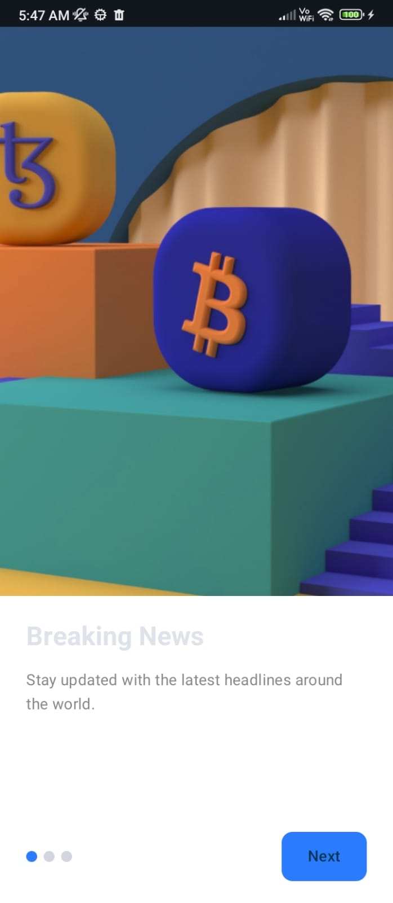
</p>

---

## 🔐 Authentication

<p align="center">
  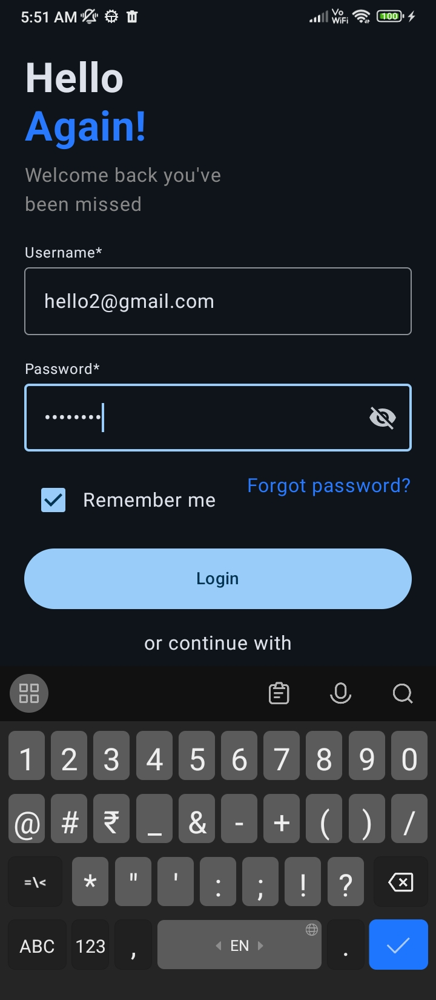
  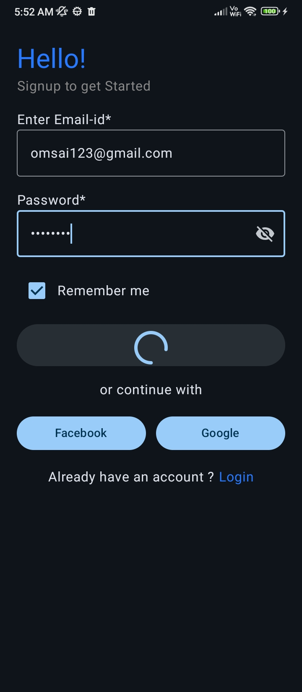
  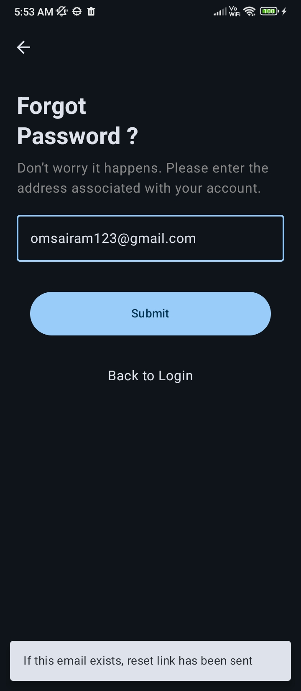
</p>

---

## 🎯 Personalize Your News

<p align="center">
  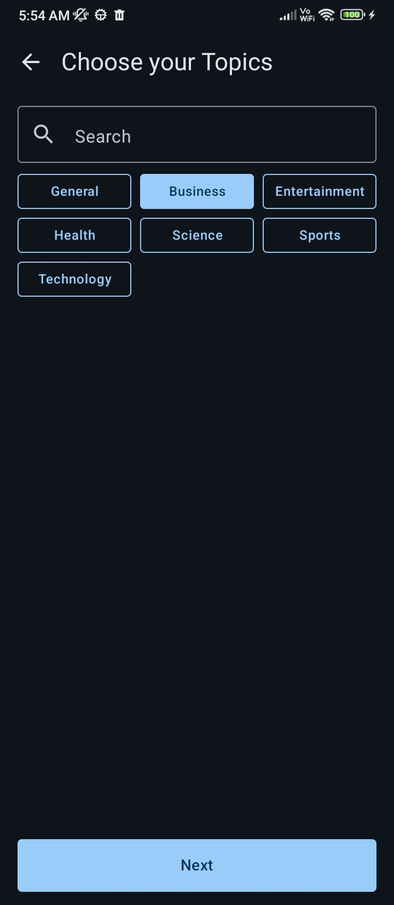
  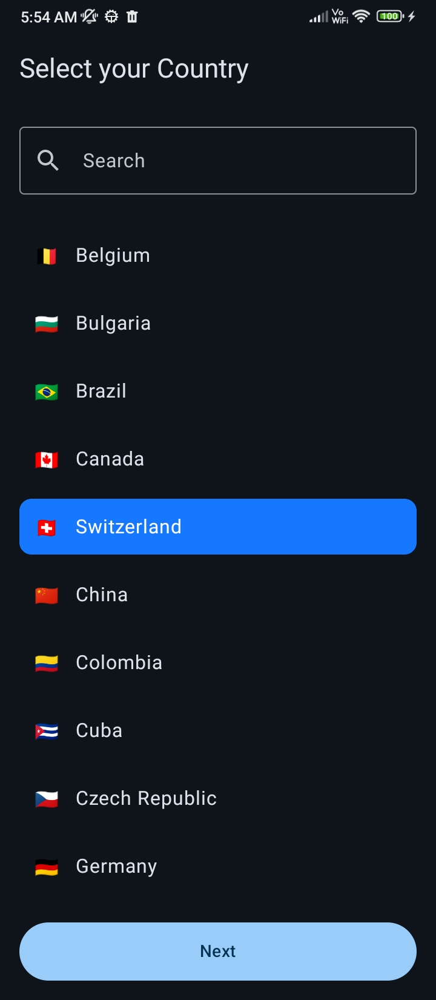
  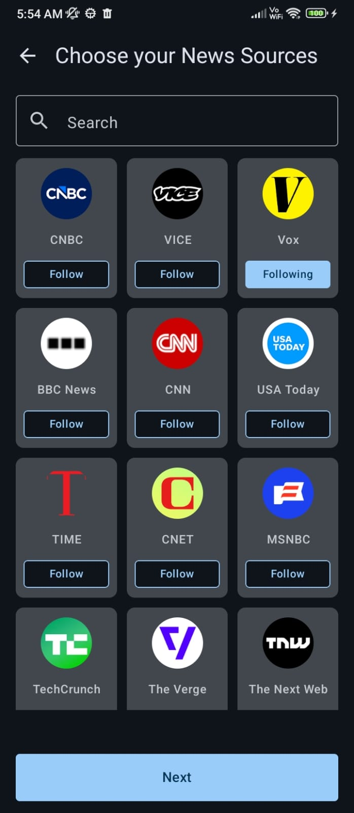
</p>

---

## 📰 Personalized News Experience

<p align="center">
  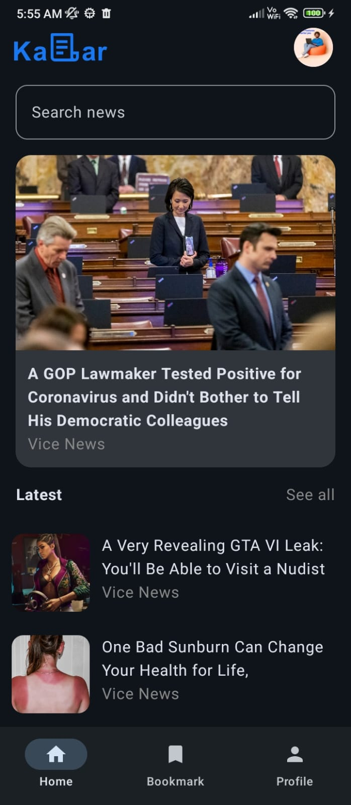
  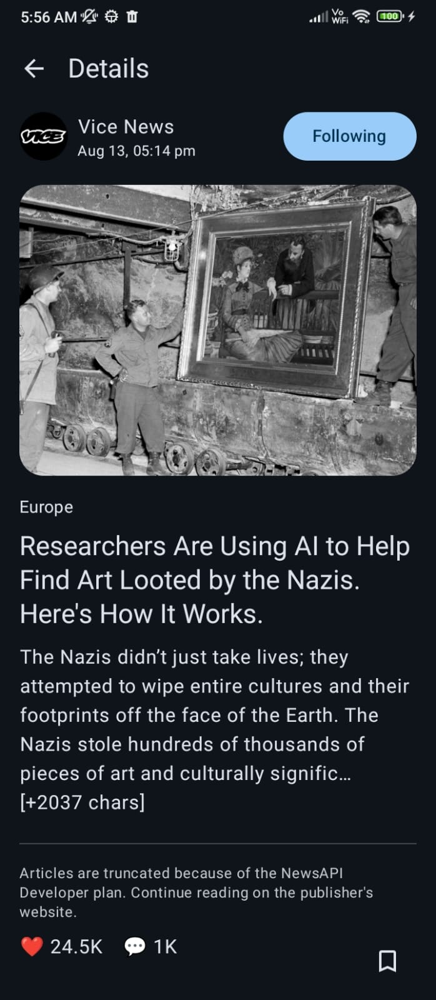
</p>

---

## 🔖 Bookmarks

<p align="center">
  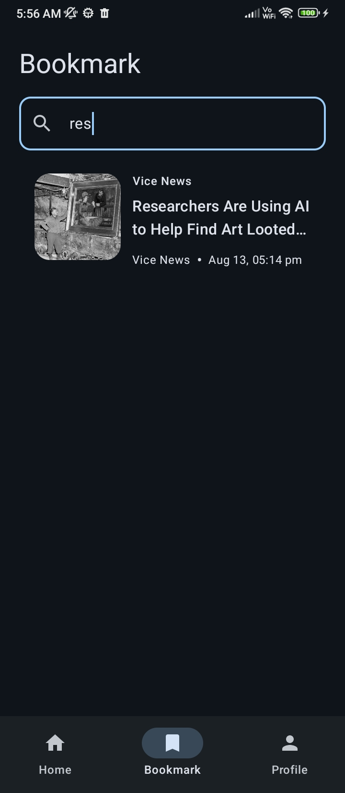
</p>

---

## 👤 Profile Management

<p align="center">
  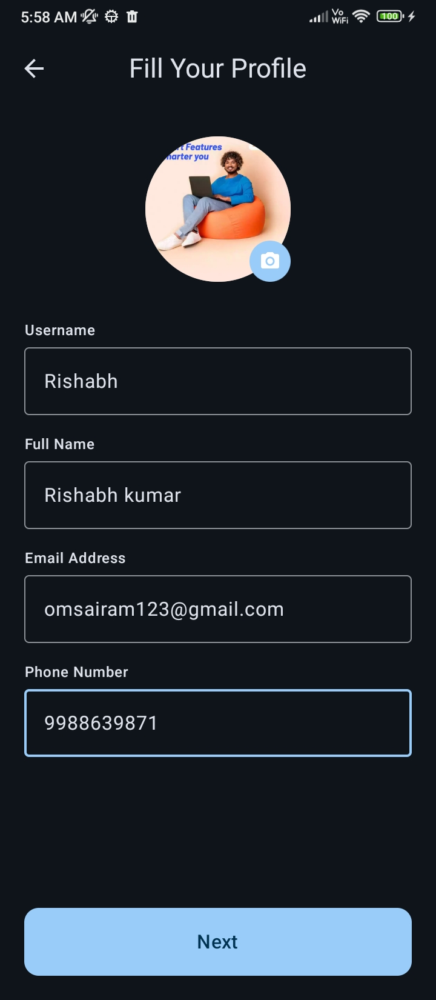
  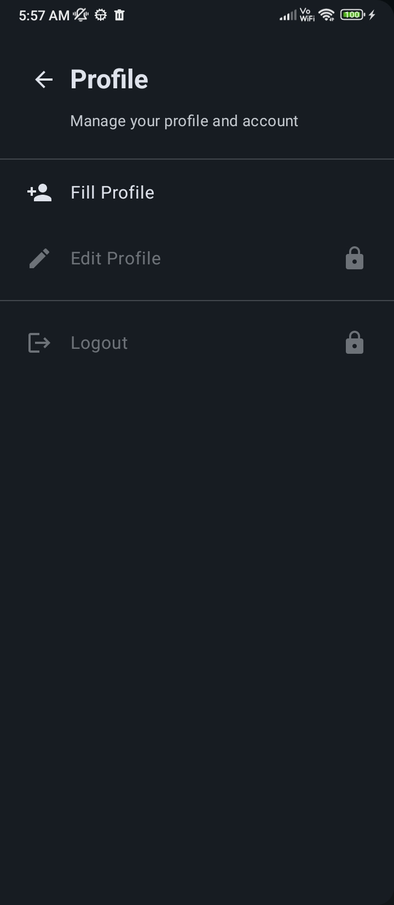
  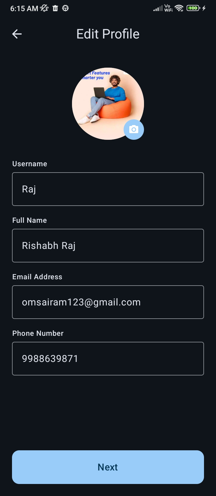
</p>

---

## 🚪 Logout

<p align="center">
  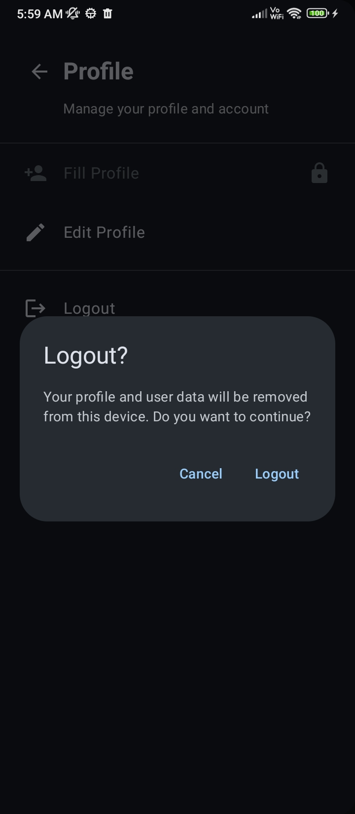
</p>
---
---

# 🎥 App Demo

A complete walkthrough of **LimitlessNews(Kabar)**, showcasing the main features and user experience.

<p align="center">
  <a href="https://drive.google.com/file/d/1UHQSm8RC11c_Qi9neKAfVFshevzorI5U/view?usp=sharing">
    
  </a>
</p>

<p align="center">
  <a href="https://drive.google.com/file/d/1UHQSm8RC11c_Qi9neKAfVFshevzorI5U/view?usp=sharing">
    ▶️ <b>Click here to watch the complete LimitlessNews(Kabar) App Demo</b>
  </a>
</p>

---

## 🚀 Demo Highlights

Splash  
↓  

Onboarding  
↓  

Authentication  
↓  

Topic Selection  
↓  

Country Selection  
↓  

News Source Selection  
↓  

Personalized Home Feed  
↓  

Infinite Scrolling with Paging 3  
↓  

Search News  
↓  

Article Details  
↓  

Bookmark Articles  
↓  

Profile & Edit Profile  
↓  

Logout


---

## 🚀 Demo Highlights

Splash  
↓  
Onboarding  
↓  
Authentication  
↓  
Topic Selection  
↓  
Country Selection  
↓  
News Source Selection  
↓  
Personalized Home Feed  
↓  
Infinite Scrolling with Paging 3  
↓  
Search News  
↓  
Article Details  
↓  
Bookmark Articles  
↓  
Profile & Edit Profile  
↓  
Logout
---

# 👨‍💻 Developer

**Rishabh Pandey**

Android Developer focused on building scalable and maintainable Android applications using modern development practices.

**Kotlin • Jetpack Compose • Clean Architecture • MVVM • Firebase • Modern Android Development**

---

## ⭐ Support

If you find this project interesting, consider giving the repository a **star ⭐**.
